# Internet-Banking
Aplicação completa de um banco digital

___

##### 1º Etapa

- Crie um fork do repositório
- Clone o repositório para a máquina local
- Instale o express com o comando "npm install express"
- Instale o nodemon como dependência de desenvolvimento com o comando "npm install -D nodemon"
- Instale o pacote de formatação de datas com o comando "npm install date-fns"
- Instale o Insomnia

___

##### 2º Etapa

Esta etapa é focada nos testes da aplicação, a aplicação precisa ser iniciada como comando "npm dev run", conforme script informado no arquivo package.json "dev": "nodemon ./src/index.js".

Após iniciada a aplicação, iniciaremos os testes de:

- Listagem de Contas
- Criação de Contas
- Atualizar Contas
- Deletar Contas
- Depósitos
- Saques
- Transferências
- Consulta de Saldos
- Extrato Bancário

___

##### 3ª Etapa

## Teste de Listagem de Contas

Para listar contas é necessário criar um http request com o verbo GET no 
insomnia para o caminho: http://localhost:3000/contas

Nota se que ao iniciar a aplicação e listar as contas, a aplicação entrega um array vazio (Imagem 1), pois não informações no banco de dados, e ao criar uma conta e realizar outro request de listar contas, a aplicação entrega o array com as informações da primeira conta, conforme segunda imagem.

#### Imagem 1
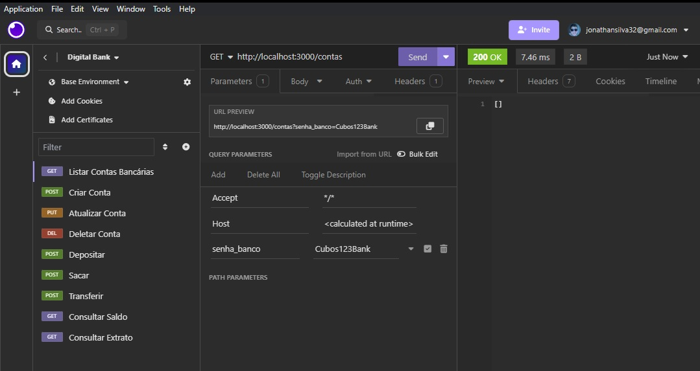

#### Imagem 2
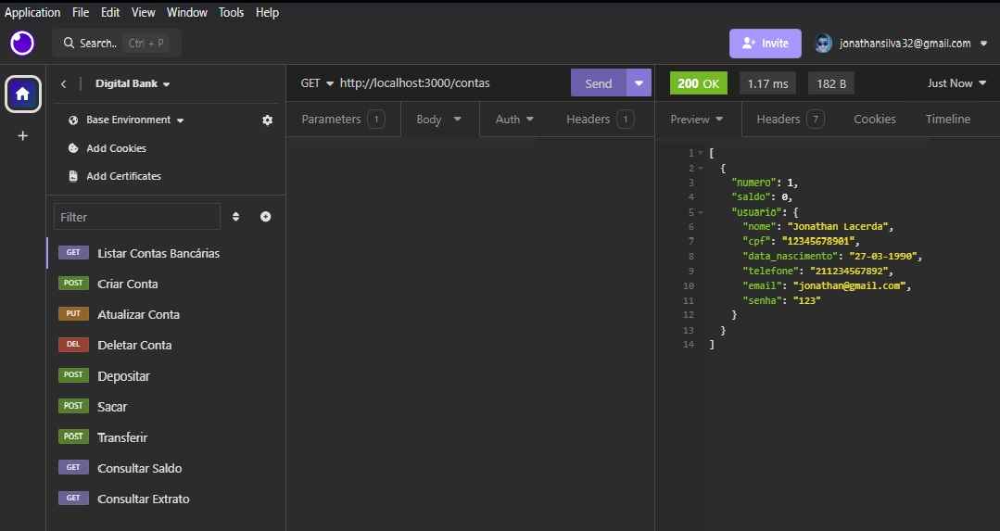

___

##### 4ª Etapa

## Criação de Contas

Para a criação de contas é necessário criar um http request com o verbo POST no insomnia para o caminho: http://localhost:3000/contas

Na criação de contas será necessário inputar as informações obrigatórias, são elas:

- Nome
- cpf
- data_nascimento
- telefone
- email
- senha

Lembrando que cpf e email são informações únicas, caso haja na base algum cpf ou email repetidos a aplicação vai gerar essa notificação.

Para isso, basta informar tudo solicitado acima no body da requisição para que seja criada uma conta conforme imagem abaixo (Imagem 3):

#### Imagem 3
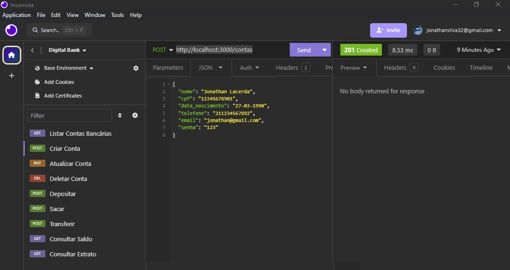

___
##### 4ª Etapa

## Atualização de Contas

Para a atualização de contas é necessário criar um http request com o verbo PUT no insomnia para o caminho: http://localhost:3000/contas/1/usuario

Onde é necessário indicar o número do usuário que se quer atualizar.

Essa aplicação informa quando o cpf e email que queira atualizar sejam os mesmos existentes para o usuário escolhido, como podemos ver na imagem 4 essas são as informações que serão atualizadas, e ao listas as contas podemos ver que foram atualizadas conforme imagem 5

#### Imagem 4
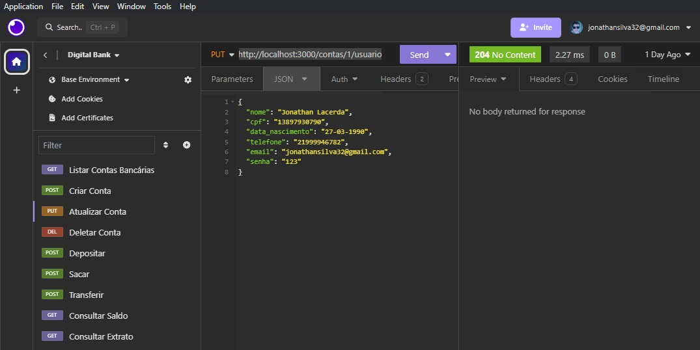

#### Imagem 5
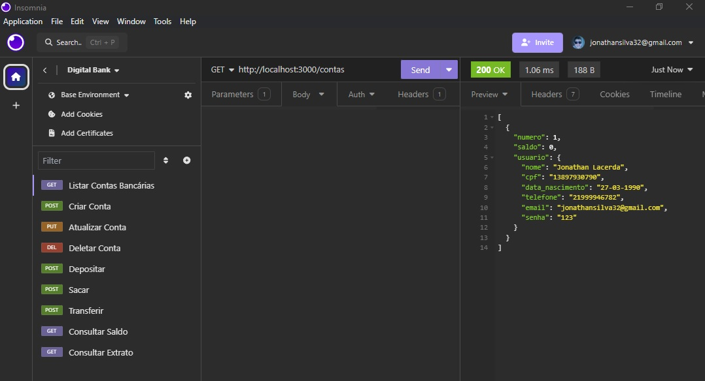

___
##### 5ª Etapa

## Deletar Contas

Para deletar contas é necessário criar um http request com o verbo DELETE no insomnia para o caminho: http://localhost:3000/contas/1/

Onde é necessário indicar o número do usuário que se quer deletar.

Ao selecionar o usuário para ser deletado, basta apenas selecionar Send e esse usuário deixa de ser listado na aplicação Listar Contas Bancárias conforme imagem 6 abaixo, onde podemos ver o array vazio novamente:

#### Imagem 6
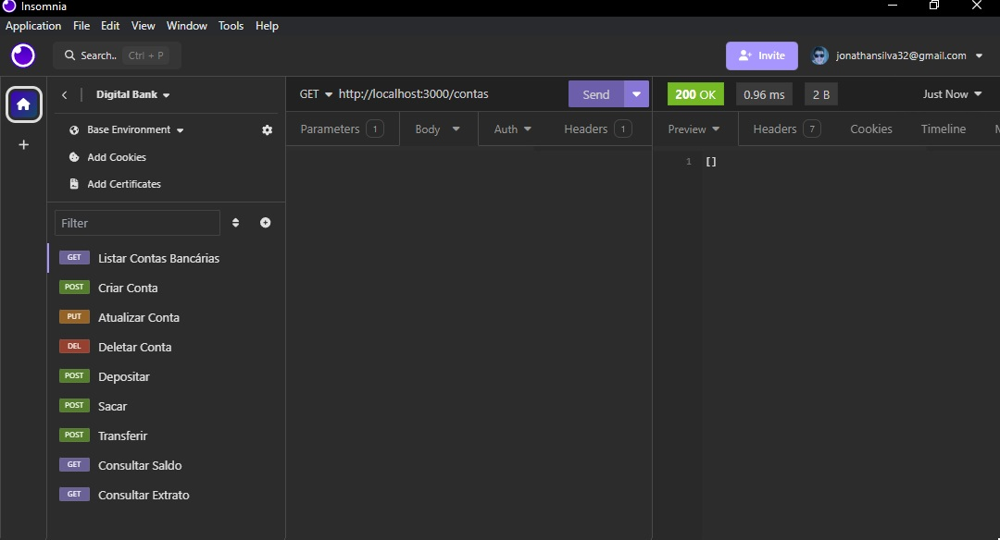

___
##### 6ª Etapa

## Depósitos

A partir de agora trataremos das transações dessa aplicação, sendo a primeira delas o depósito, como demonstrado na imagem 5 o saldo do usuário na criação da sua conta é por padrão zero. Então para que a aplicação de depósito funcione é necessário a criação de um http request com o verbo POST no caminho: http://localhost:3000/transacoes/depositar

Com as seguintes informações no body:

- numero_conta
- valor

conforme print abaixo (Imagem 7)

#### Imagem 7
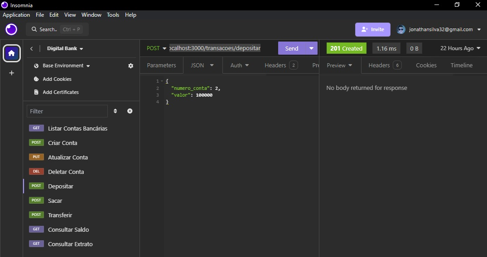

 

Logo ao consultar na listagem de contas, podemos ver que o saldo foi inserido (Imagem 8):

#### Imagem 8
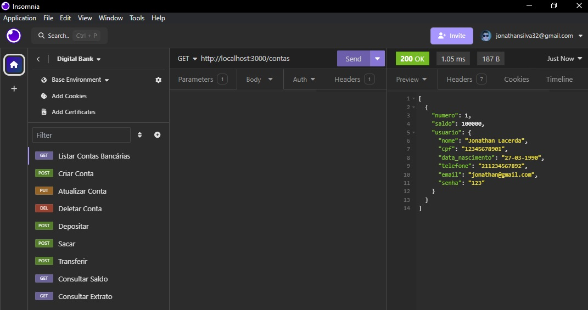

___
##### 7ª Etapa

## Saques

Nesta etapa da aplicação testaremos os saques, que tem o mesmo verbo POST no caminho http://localhost:3000/transacoes/sacar do depósito, porém foi incluído uma validação de senha para que seja possível realizar o saque, então no body além do número da conta e do valor a sacar, é necessário informar a senha. Lembrando que também é validado se há saldo disponível para saque, caso não a aplicação retorna a mensagem de "Saldo Indisponível", assim como a validação de senha, caso a mesma esteja errada a aplicação retorna a mensagem de "Senha inválida", conforme imagem 9 abaixo podemos ver que todos os campos foram informados e na imagem 10, na listagem de contas podemos ver que o saldo foi ajustado após o saque:

#### Imagem 9
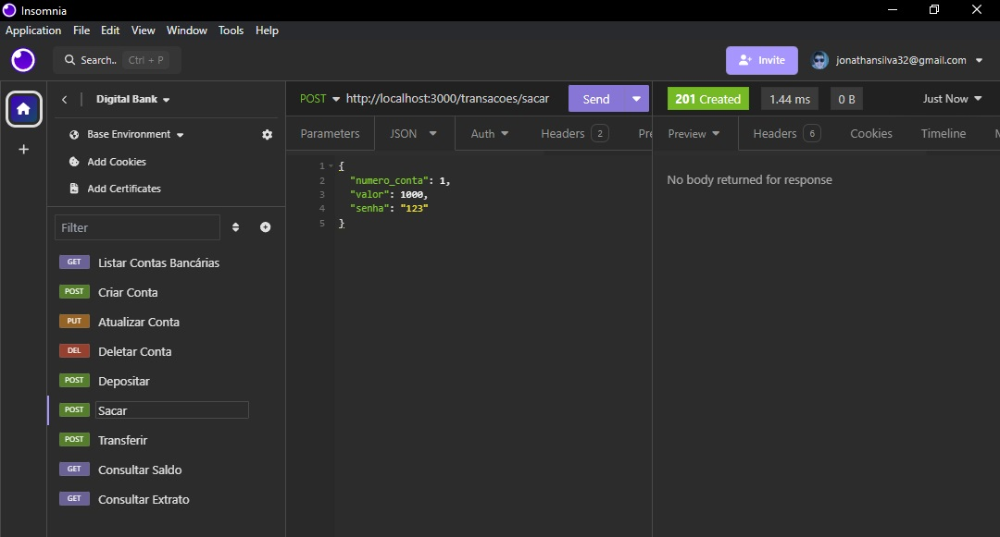

#### Imagem 10
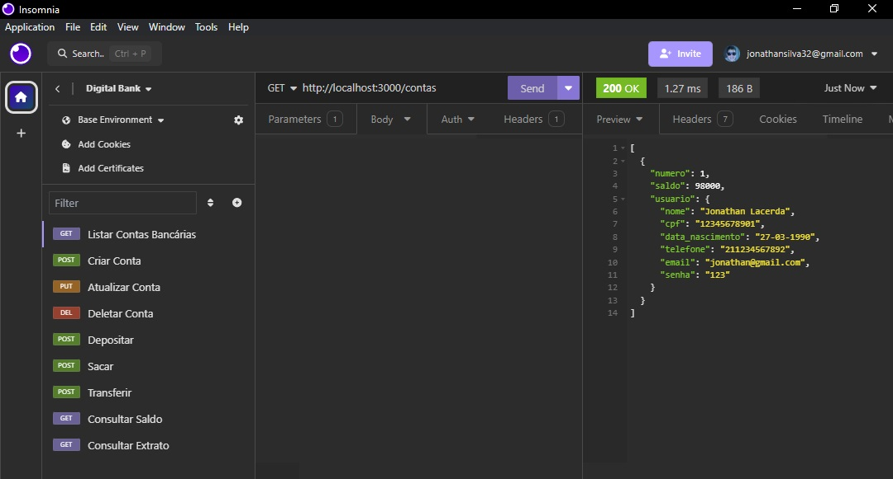

___
##### 7ª Etapa

## Transferências

Para a etapa de transferências será necessário criar um http request com o verbo POST no caminho http://localhost:3000/transacoes/transferir e para isso será necessário criar duas contas conforme imagem abaixo (Imagem 11):

#### Imagem 11

Já na imagem abaixo, precisamos informar a conta de origem e a conta destino para que seja realizada a transferência assim como a informação da senha. Nesta etapa a aplicação valida a existência das duas contas retornando a mensagem "Conta Inexistente" caso uma das contas informadas não exista, e também faz a validação de senha assim como na etapa anterior:

#### Imagem 12
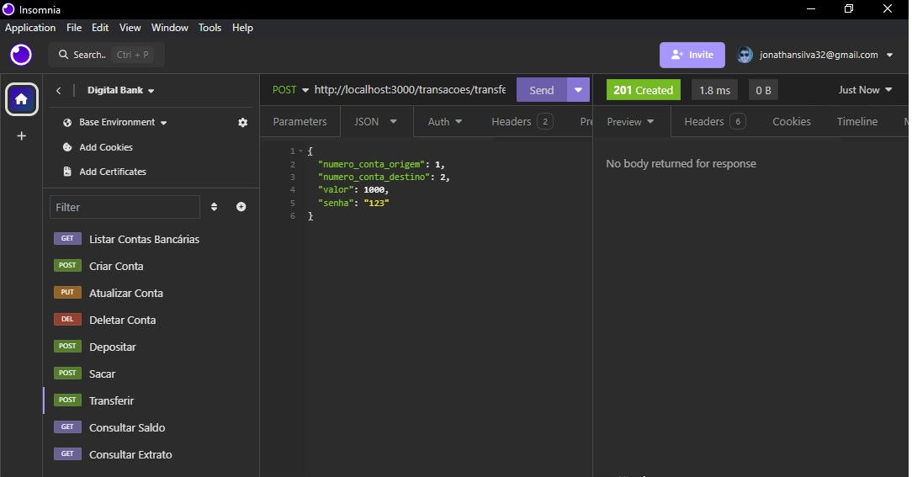

E na imagem abaixo podemos ver que os saldos das contas são ajustados conforme a informação de transferência, bastando apenas listar as contas novamente:

#### Imagem 13
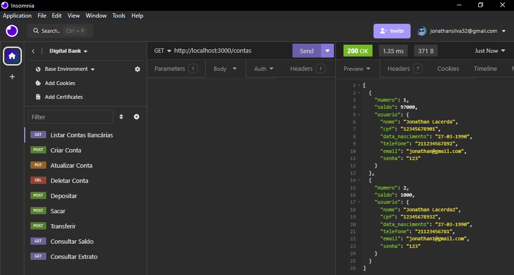

___
##### 8ª Etapa

## Saldo e Extrato

Nesta última etapa verificaremos os saldo e o extrato de todas as transações realizadas anteriormente. Todas elas através de um http request de verbo GET, nos caminhos respectivamente: http://localhost:3000/contas/saldo e http://localhost:3000/contas/extrato.

Conforme a imagem abaixo, podemos ver a requisição de consulta de saldo:

Para a consulta de saldo, é necessário as seguintes informações:

- numero_conta
- senha

Todas as informações passam pela validação de existência da conta e a validação de senha para que seja gerado o saldo da conta.

#### Imagem 14
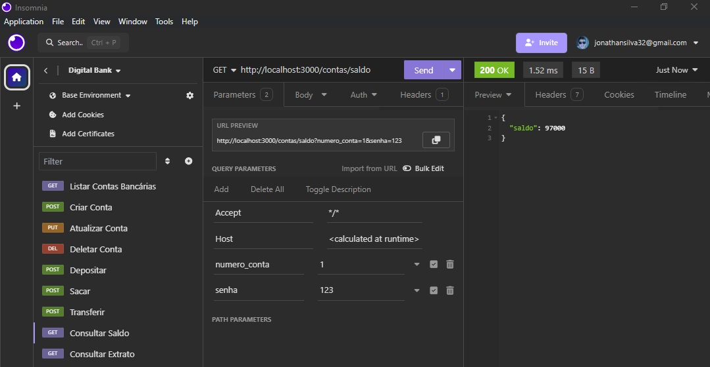

E para o extrato, as informações necessárias são as mesmas do saque, gerando a imagem abaixo:

#### Imagem 15
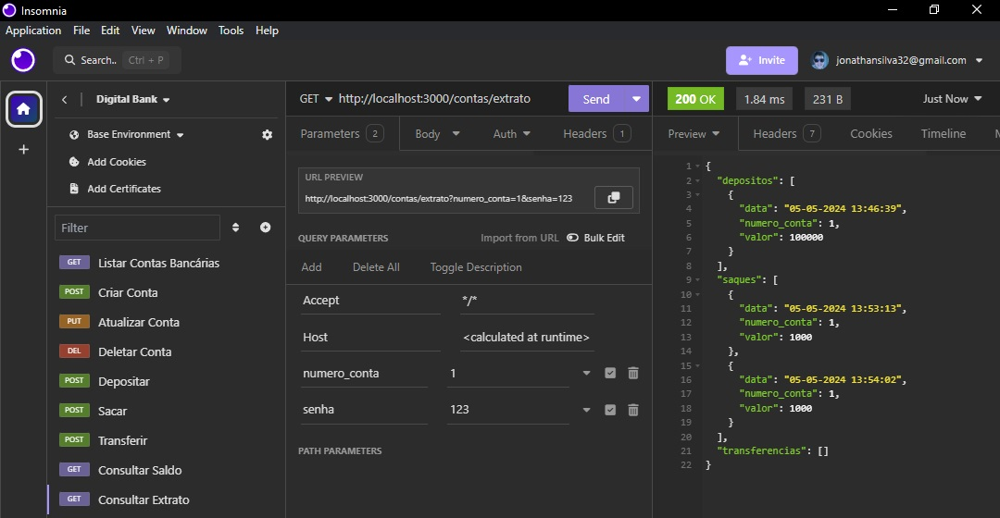

